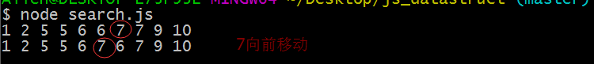
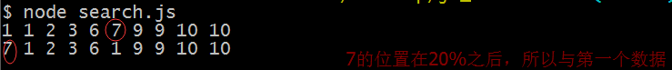
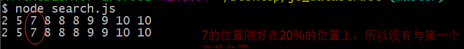
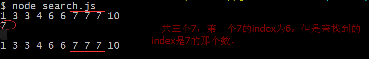
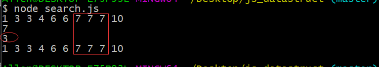

# 检索算法
列表查找数据的两种方式：
*  顺序查找
* 二分查找

为了体现封装性，我们任然是用sort.md中的CArray来编写代码
```
function CArray(numElements) {
    this.dataStore = [];
    this.numElements = numElements;
    this.pos = 0;
    for(var i = 0; i < this.numElements; i ++) {
        this.dataStore[i] = i;
    }
}
```
辅助方法
```
CArray.prototype.setData = function() {
    var len = this.numElements;
    for(var i = 0; i < len; i ++) {
        this.dataStore[i] = Math.floor(Math.random() * (len + 1));
    }
    this.dataStore.sort(function (a, b) {
        return a - b;
    });
}
CArray.prototype.toString = function () {
    var ret = '';
    var len = this.numElements;
    for(var i = 0; i < len; i ++) {
        ret += this.dataStore[i] + ' ';
    }
    return ret;
}

CArray.prototype.swap = function (index1, index2) {
    var temp = this.dataStore[index1];
    this.dataStore[index1] = this.dataStore[index2];
    this.dataStore[index2] = temp;
}
```
> 顺序查找

从列表第一个元素开始队列表元素进行判断，直到找到想要的结果，或者直到列表结尾没有找到。
此外我们的程序要能够实现自组织：经过多次的查找，查找最频繁的数据应该在列表的前列

第一种方式是将每次查找到的数据都向前移一位，这样经过多次查找，经常查询的数据就会出项在列表前列。
```
//自组织顺序查找（每次查找的元素位置会提前）
CArray.prototype.seqSearch1 = function (data) {
    var len = this.numElements;
    for(var i = 0; i < len; i ++) {
        if(this.dataStore[i] == data) {
            this.swap(i, i - 1);
            return true;
        }
    }
    return false;
}
```


第二种方式类似于“80-20法则”,判断查找到的数据是否属于列表总长度的前20%，如果不属于就将其位置与第一个交换

```
//自组织顺序查找（每次查找，如果该元素不在总长度的20%内，会将找到的元素放到第一位）80-20法则
CArray.prototype.seqSearch2 = function (data) {
    var len = this.numElements;
    for(var i = 0; i < len; i ++) {
        if(this.dataStore[i] == data) {
            if(i > Math.round(0.2 * len)) {
                this.swap(i, 0);
            }
            return true;
        }
    }
    return false;
}
```




> 二分查找法

顺序查找适合无序的列表，如果列表是一个有序的集合，为了提高效率，用二分查找法的话效率更高

```
//二分法查找算法
CArray.prototype.binSearch = function (data) {
    var len = this.numElements;
    var upperBound = len - 1,
        lowerBound = 0;
    while(lowerBound <= upperBound) {
        var mid = Math.floor((upperBound + lowerBound) / 2);
        if(this.dataStore[mid] > data) {
            upperBound = mid - 1;
        }else if(this.dataStore[mid] < data) {
            lowerBound = mid + 1;
        }else {
            return mid;
        }
    }
    return -1;
}
```
二分查找虽然提高了效率，但是不知道有没有发现这样一个问题


当binSearch函数找到某个值的时候，如果数据集中还有其他几个相同的数据出现，那么该函数会定位在类似值的附近。换句话说，其他值可能会出现在已找到的值的左边或者右边。（即找到的可能不是第一个出现的数据）

如果想要直到列表中总共有多少数据与想要查找的数据相同，可以编写一个count函数
```
//二分法总是查找中间的值，统计重复值
CArray.prototype.count = function (data) {
    var count = 0;
    var pos = this.binSearch(data);
    var len = this.numElements;
    if(pos > -1) {
        count ++;
        for(var i = pos - 1; i >= 0; i--) {
            if(this.dataStore[i] == data) {
                count ++;
            }else {
                break;
            }
        }
        for(var j = pos + 1; j < len; j ++) {
            if(this.dataStore[j] == data) {
                count ++;
            }else {
                break;
            }
        }
    }
    return count;
}
```


如图所示，还是那个例子，统计出有三个7

> 就酱紫~


