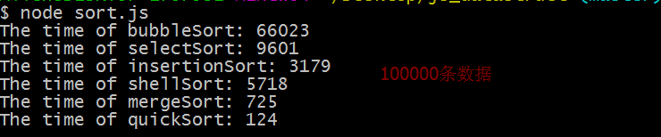
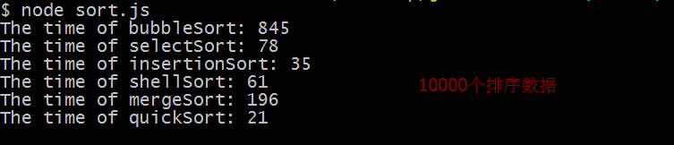
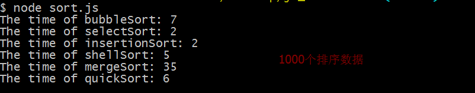

# javascript排序

对于算法来说，排序问题应该说是最简单也是最常见的算法了。今天，我们通过javascript脚本语言来写一些经典的排序算法。排序算法大致可以分别两大类，基本排序算法和高级排序算法。常见的基本排序算法有：冒泡、选择、插入。一些高级排序：希尔、归并、快排。下面我们就来一一介绍(为了比较各个算法的效率问题，我们统一到最后进行展示)

为了整合代码，我们将所有的排序方法封装在CArray构造函数中

``` 
    function CArray(numElements) {
        this.dataStore = [];
        this.pos = 0;
        this.numElements = numElements;
        this.gaps = [];//希尔排序的间隔序列
        for(var i = 0; i < numElements; i ++) {
            this.dataStore[i] = i;
        }
    }
```
还需要有一些辅助类的函数
```
    CArray.prototype.setData = function () {
        for(var i = 0; i < this.numElements; i ++) {
            this.dataStore[i] = Math.ceil(Math.random() * (this.numElements + 1));
        }
    }

    CArray.prototype.clear = function () {
        for(var i = 0; i < this.numElements; i ++) {
            this.dataStore[i] = 0;
        }
    }

    CArray.prototype.insert = function (ele) {
        this.dataStore[this.pos ++] = ele;
    }

    CArray.prototype.toString = function () {
        var restr = '';
        for(var i = 0; i < this.numElements; i ++) {
            restr += this.dataStore[i] + ' ';
        }
        return restr;
    }

    CArray.prototype.swap = function (arr, index1, index2) {
        var temp = arr[index1];
        arr[index1] = arr[index2];
        arr[index2] = temp;
    }
```
*** 

#### 冒泡排序
说到冒泡排序，大家最熟悉不过了，冒泡的目的是将大的数据移动到末尾，故称为冒泡。

```
//冒泡排序
CArray.prototype.bubbleSort = function () {
    var startTime = new Date().getTime();
    var len = this.numElements;
    for(var i = 0; i < len - 1; i ++) {
        for(var j = 0; j < len - i; j ++) {
            if(this.dataStore[j] > this.dataStore[j + 1]) {
                this.swap(this.dataStore, j, j + 1);
            }
        }
    }
    var endTime = new Date().getTime();
    var elapsed = endTime - startTime;
    console.log('The time of bubbleSort: ' + elapsed);
}
```
#### 选择排序
选择排序与冒泡排序相反，冒泡是将大的数据冒泡到队尾，然而选择排序是将小的数据排到前面。
```
//选择排序
CArray.prototype.selectSort = function () {
    var startTime = new Date().getTime();
    var len = this.numElements;
    for(var i = 0; i < len - 1; i ++) {
        var data1 = this.dataStore[i];
        var minIndex = i;
        for(var j = i + 1; j < len; j ++) {
            var data2 = this.dataStore[j];
            if(data1 > data2) {
                data1 = data2;
                minIndex = j;
            }
        }
        if(i != minIndex) {
            this.swap(this.dataStore, i, minIndex);            
        }
    }
    var endTime = new Date().getTime();
    var elapsed = endTime - startTime;
    console.log('The time of selectSort: ' + elapsed);
}
```

#### 插入排序
插入排序是将每一个元素与它前面的所有元素进行比较，从数组第二位开始递归执行，所以元素前面的数据都是排好顺序的，只需要移位将该元素插入即可
```
//插入排序
CArray.prototype.insertionSort = function () {
    var startTime = new Date().getTime();
    var len = this.numElements;
    for(var i = 1; i < len; i ++) {
        var temp = this.dataStore[i];
        var j = i;
        while(j > 0 && this.dataStore[j - 1] > temp) {
            this.dataStore[j] = this.dataStore[j - 1];
            j --;
        }
        this.dataStore[j] = temp;
    }
    var endTime = new Date().getTime();
    var elapsed = endTime - startTime;
    console.log('The time of insertionSort: ' + elapsed);
}
```

#### 希尔排序
希尔排序是插入排序的升级版本，原理与插入排序相同，只是希尔排序通过有效次数间隔不同的插入排序进行排序。

```
//希尔排序
CArray.prototype.setGaps = function (arr) {
    this.gaps = arr;
}
CArray.prototype.shellSort = function () {
    var startTime = new Date().getTime();
    var len = this.numElements;
    for(var i = 0; i < this.gaps.length; i ++) {
        for(var j = this.gaps[i]; j < len; j ++) {
            var temp = this.dataStore[j];            
            for(var k = j; k > 0 && this.dataStore[k - this.gaps[i]] > temp; k -= this.gaps[i]) {
                this.dataStore[k] = this.dataStore[k - this.gaps[i]];
            }
            this.dataStore[k] = temp;            
        }
    }
    var endTime = new Date().getTime();
    var elapsed = endTime - startTime;
    console.log('The time of shellSort: ' + elapsed);
}
```

#### 归并排序
归并排序是将一个大数组分成两个小数组，在将两个小数组进行分割，直到有数组的元素为1，对小数组惊醒排序，然后在将两个小数组合并排序形成新的有序数组，递归排序。这里的递归设计到递归深度的问题，我试了1000000次nodejs运行环境的归并排序并没有出现这种情况。

```
/归并排序
// 自顶向下的递归方法（递归深度太深）
CArray.prototype.mergeSort = function () {
    var startTime = new Date().getTime();
    this.dataStore = this.mergeSortHelper(this.dataStore);
    var endTime = new Date().getTime();
    var elapsed = endTime - startTime;
    console.log('The time of mergeSort: ' + elapsed);
}
CArray.prototype.mergeSortHelper = function (arr) {
    var len = arr.length;
    if(len < 2) {
        return arr;
    }
    var middle = Math.floor(len / 2);
    var left = arr.slice(0, middle),
        right = arr.slice(middle);
    return this.merge(this.mergeSortHelper(left), this.mergeSortHelper(right));
}
CArray.prototype.merge = function (left, right) {
    var result = [];
    result = left.concat(right);
    return result.sort(function (a, b) {
        return a - b;
    });
}
```

#### 快速排序
最经典的排序，也是最快的排序。通过选出一个暂定值将数组分成大于它的和小于它的两个数组，在将两个数组执行这样的操作，直到数组有数组的元素小于2个，将他们按照顺序合并就好。
```
//快速排序
CArray.prototype.quickSort = function (arr) {
    var startTime = new Date().getTime();
    this.dataStore = this.quickSortHelper(this.dataStore);
    var endTime = new Date().getTime();
    var elapsed = endTime - startTime;
    console.log('The time of quickSort: ' + elapsed);
}
CArray.prototype.quickSortHelper = function (arr) {
    if(arr.length < 2) {
        return arr;
    }
    var lesser = [],
        greater = [];
    var pivot = arr[0];
    for(var i = 1; i < arr.length; i ++) {
        if(arr[i] < pivot) {
            lesser.push(arr[i]);
        }else {
            greater.push(arr[i]);
        }
    }
    return this.quickSortHelper(lesser).concat(pivot, this.quickSortHelper(greater));
}
```
***
#### 测试代码
```
var numElements = 100000;
var myNums1 = new CArray(numElements);
var myNums2 = new CArray(numElements);
var myNums3 = new CArray(numElements);
var myNums4 = new CArray(numElements);
var myNums5 = new CArray(numElements);
var myNums6 = new CArray(numElements);


myNums1.setData();
myNums2.setData();
myNums3.setData();

myNums4.setGaps([5, 3, 1]);
myNums4.setData();
myNums5.setData();
myNums6.setData();

// console.log('before sort: ');
// console.log(myNums6.toString());
myNums1.bubbleSort();
myNums2.selectSort();
myNums3.insertionSort();
myNums4.shellSort();
myNums5.mergeSort();
myNums6.quickSort();
// console.log('after sort: ');
// console.log(myNums6.toString());
```

这是100000数据的排序耗时


这是10000数据的排序耗时


这是1000数据的排序耗时

高级算法更适合大数据的运算，在小数据运算上可能不如基本排序算法，但是快速排序无论是大数据还是小数据量，表现都是很好。


